# OpenVLA-OFT: Extreme-Retention Sweep and Oracle Patch Selection on LIBERO-Spatial

**Period:** 2026-08-19 (retention sweep start) → 2026-08-21 19:40 KST (oracle keep-5 finished)
**Model:** `moojink/openvla-7b-oft-finetuned-libero-spatial` (OpenVLA-OFT, 2 camera views, 8-step action chunks, L1-regression action head)
**Benchmark:** LIBERO-Spatial, 10 tasks
**Hardware:** 1× RTX 5090 (32 GB), conda env `openvla-oft`, code under `src/openvla-oft/`

---

## 1. Background — why this experiment

VLA-Pruner (arXiv:2511.16449) prunes visual tokens inside the VLA's language model using attention-derived importance (semantic prefill attention fused with temporally smoothed action-to-vision attention). Earlier in this study we measured it on OpenVLA-OFT at the paper's operating points (90 % pruning: 96.6 % success vs 98.8 % unpruned) and found the model remarkably robust. Two questions followed:

1. **How far can retention be pushed?** We swept the number of kept patches per view down to the extreme (5, 4, 3, 2, 1 and 0 of 256) to locate the point where the policy collapses.
2. **When it collapses, is that an *information* limit (the few remaining patches simply cannot carry the task signal) or a *selection* limit (enough signal exists in k patches, but attention-based scoring fails to find them)?**

To separate the two, we built an **oracle selector**: at every model query it searches for the k patches per view whose pruned-input action is closest to the full-input action, then executes that pruned-input action. Its success rate is an upper bound on what *any* selection criterion can achieve at retention k. A large oracle-vs-attention gap means headroom for better selection; a small gap means the retention itself is the limit.

---

## 2. Verification — experiment design

### 2.1 Common evaluation protocol
* LIBERO-Spatial, default initial states, `num_steps_wait = 10`, max 220 env steps per episode; success = task completion flag from the environment.
* One model query per 8 env steps (OFT executes the whole action chunk open-loop); ~11–28 queries per episode.
* Pruning is applied at LLM layer `fastv_k = 3` (the fork's `vla_pruner_layer = 15` only selects which layer's attention feeds the temporal history — it does **not** set the pruning layer). Layers 0–3 always see all 512 visual tokens; layers 4–31 see only the kept ones.
* Retention is **per view**: `k = round(256 × (1 − fastv_r))` patches kept in each of the two views independently (`fastv_r = 1 − k/256`).
* VLA-Pruner temporal warm-up: the first 3 queries of every episode run unpruned (temporal history not yet full). The oracle uses the identical 3-query warm-up so the two conditions differ *only* in how patches are chosen.
* Trials: attention-based runs 50 trials/task (500 episodes); oracle runs 10 trials/task (100 episodes) because of search cost (±5 pts at 50 % success vs ±2 pts).
* Every episode additionally renders a verification video with frames laid out as `[input view 1 | pruned view 1 | input view 2 | pruned view 2]`, dropped patches blacked out. Mask counts were checked programmatically for every run (warm-up frames 0 masked; later frames exactly 256 − k masked per view).

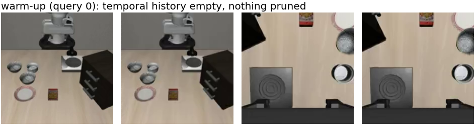
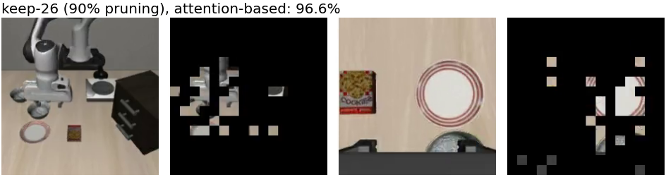
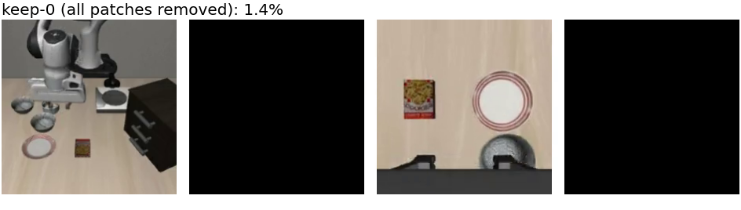

*Figure 2 — The verification-video frame format: `[agentview input | pruned | wrist input | pruned]`. Top: warm-up query (nothing pruned). Middle: the paper's 90 % operating point (26 patches/view kept). Bottom: all 512 visual tokens removed after layer 3.*

### 2.2 Attention-based selection (VLA-Pruner, `--use_vla_pruner True --vla_pruner_mode semantic_action`)
Per query, per view: top-k by prefill (semantic) attention ∪ top-k by (temporally smoothed) action attention; if the union exceeds k, farthest-point selection on cosine distance over patch embeddings trims it to k. Flags: `--fastv_k 3 --fastv_r 1-k/256 --num_trials_per_task 50 --save_rollout_videos True`.

### 2.3 Oracle selection (`--use_oracle_pruner True`, new code)
**Objective.** For a query with full-input action chunk **A_full** (8 × 7, normalized action space), find the set S of k patches per view minimising mean-L1(**A**(S) − **A_full**), where **A**(S) is the action chunk the model predicts when only S survives past layer 3. Exhaustive search is intractable (C(256,k)² sets), so we use **pure greedy forward selection**: 2k rounds; in each round every remaining patch (respecting the per-view quota k) is tried as an addition to the current set and the one with the lowest L1 is kept. No candidate-pool restriction was used.

**Efficient evaluation.** Because layers 0–3 are identical for all candidate sets, they run once per query and the hidden state entering layer 4 is cached. Each candidate set is then evaluated by running only layers 4–31 on its pruned sequence (non-visual tokens + selected patches + the 56 action-query tokens + stop token, ≈70–90 tokens), batched 128 candidates per forward, with the original RoPE positions preserved and the same attention mask semantics as the repo's pruned path (`fastv_forward`). OFT predicts the whole chunk in one forward (no autoregression), so one tail forward per candidate suffices. Cost: ≈2k × ~500 candidate evaluations per query — 9.3 s/query at k = 2, 23 s/query at k = 5.

```mermaid
flowchart LR
    O[observation<br/>2 views + prompt] --> D[dense forward<br/>layers 0–31]
    D --> AF[A_full<br/>8×7 action chunk]
    D --> B[cache hidden state<br/>entering layer 4]
    B --> G{greedy round t<br/>t = 1 … 2k}
    G -->|every remaining patch c| C[candidate set S ∪ {c}<br/>non-visual + selected + c]
    C --> T[batched tail<br/>layers 4–31, ≤128 sets/forward]
    T --> H[action head → A S∪c]
    H --> L[mean-L1 vs A_full]
    L -->|argmin over c| G
    G -->|after 2k rounds| X[execute A S*<br/>render S* in video]
```
*Figure 3 — Oracle search per model query. Layers 0–3 run once; every candidate re-runs only layers 4–31 on its pruned sequence. The executed action is the pruned-input prediction of the winning set S\*, never the full-input action.*

**Executed action.** The action of the final winning set (not the full-input action) — the policy genuinely acts on k patches per view.

**Correctness gate** (`experiments/robot/libero/test_oracle_equivalence.py`, all passed before any run):
| Check | Result |
|---|---|
| FastV's own keep-set forced through the oracle evaluator reproduces FastV's pruned action | max |Δ| = 0.000000 |
| All-512 keep-set through the evaluator reproduces the dense forward | 0.000000 |
| k = 256 early exit reproduces the dense forward | 0.000000 |
| Oracle-chosen set replayed through `fastv_forward` reproduces the oracle's action | 0.0055 (bf16 batch-kernel noise) |
| Per-view quota respected; round scores decrease monotonically | ✓ |

Two pitfalls found while building the gate, both fixed: (i) OFT attends **bidirectionally** in evaluation (all attention masks resolve to `None`; with `output_attentions=True` the eager path runs unmasked) — an explicit causal mask in the oracle tail produced a 0.25 action error until matched; (ii) `get_vla_action` normalises `obs["state"]` in place, so reusing one observation dict across calls double-normalises proprio (a test-fixture issue only; the real eval loop builds a fresh dict per step).

### 2.4 Code artefacts
* `transformers/src/transformers/models/llama/modeling_llama.py`: `oracle_tail_forward` (batched tail runner), `forced_visual_indices` hook.
* `prismatic/extern/hf/modeling_prismatic.py`: `_oracle_regression_prediction` (greedy search, trace fields, sweep-compatible `pruning_info`).
* `experiments/robot/openvla_utils.py`, `experiments/robot/libero/run_libero_eval.py`: flags `use_oracle_pruner`, `oracle_batch_size`, `oracle_warmup_queries`, `oracle_candidate_pool` (unused, 0), `save_oracle_trace`; per-query trace npz (full/oracle actions, L1 gap, chosen order, round-0 singleton score map).

---

## 3. Results

### 3.1 Success rate vs kept patches per view (LIBERO-Spatial)

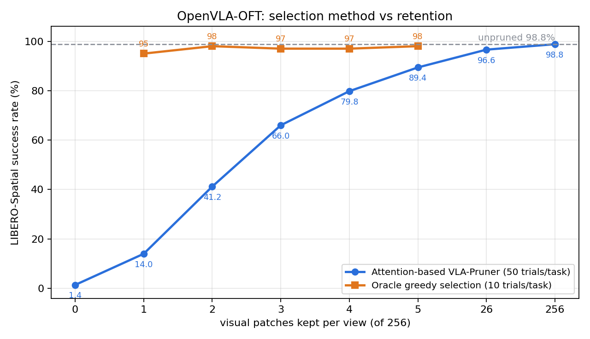

*Figure 1 — LIBERO-Spatial success as a function of visual patches kept per view. Attention-based selection (blue) degrades gently to 5 patches and then roughly linearly to 1; the oracle (orange) stays at the unpruned ceiling down to a single patch per view.*

| Patches kept / view | Pruning | Attention-based VLA-Pruner (50 trials/task) | **Oracle greedy** (10 trials/task) | Oracle mean L1 gap to A_full |
|---|---|---|---|---|
| 256 (unpruned) | 0 % | 98.8 % (494/500) | — | — |
| 26 | 90 % | 96.6 % (483/500) | — | — |
| 5 | 98.0 % | 89.4 % (447/500) | **98.0 %** (98/100) | 0.032 |
| 4 | 98.4 % | 79.8 % (399/500) | **97.0 %** (97/100) | 0.037 |
| 3 | 98.8 % | 66.0 % (330/500) | **97.0 %** (97/100) | 0.044 |
| 2 | 99.2 % | 41.2 % (206/500) | **98.0 %** (98/100) | 0.055 |
| 1 | 99.6 % | 14.0 % (70/500) | **95.0 %** (95/100) | 0.082 |
| 0 | 100 % | 1.4 % (7/500) | — | — |

(FastV at 90 % pruning, for reference: 95.8 %.)

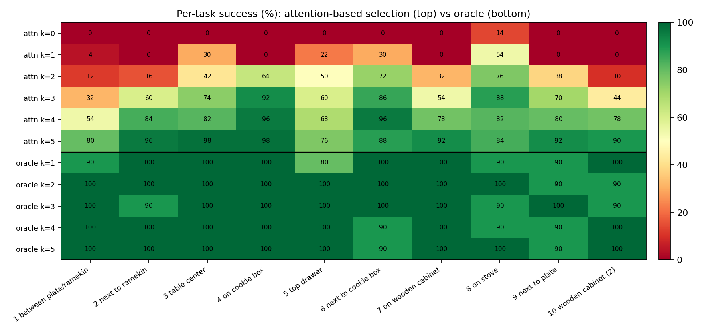

*Figure 4 — Per-task success for every run. Attention-based selection loses whole tasks as k shrinks (five tasks at 0 % with one patch per view); the oracle never drops below 80 % on any task at any k.*

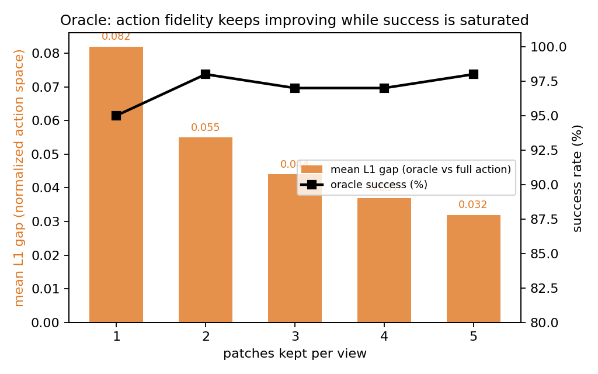

*Figure 5 — The oracle's action fidelity (mean L1 between the k-patch action and the full-patch action) improves smoothly with k, while its success rate is already saturated at k = 1.*

### 3.2 Per-task detail (tasks 1–10, %)
Attention-based:
* k=5: 80 96 98 98 76 88 92 84 92 90
* k=4: 54 84 82 96 68 96 78 82 80 78
* k=3: 32 60 74 92 60 86 54 88 70 44
* k=2: 12 16 42 64 50 72 32 76 38 10
* k=1: 4 0 30 0 22 30 0 54 0 0
* k=0: all 0 except task 8 ("bowl on the stove", a fixed landmark) at 14

Oracle:
* k=5: 100 100 100 100 100 90 100 100 90 100
* k=4: 100 100 100 100 100 90 100 90 90 100
* k=3: 100 90 100 100 100 100 100 90 100 90
* k=2: 100 100 100 100 100 100 100 100 90 90
* k=1: 90 100 100 100 80 100 100 90 90 100

### 3.3 Findings
1. **Attention-based selection degrades gently down to 5 patches/view (−9 pts) and then roughly linearly at ~15–25 pts per patch through k = 4…1, collapsing to 1.4 % with no patches.** Only 0.4 % of the visual tokens (1 patch/view) still yields 14 %; the stove task survives even blind because a memorised reach occasionally works.
2. **The oracle is flat at the unpruned ceiling from a single patch per view upward (95–98 % vs 98.8 %)**, with no task below 80 % at any k. The 14 → 95 point gap at k = 1 and 41 → 98 at k = 2 show the low-retention cliff is a **selection limit, not an information limit**: one or two well-chosen patches per view carry essentially all task-critical visual signal, but attention-derived scores cannot reliably find them.
3. **Action fidelity improves smoothly with k (mean L1 gap 0.082 → 0.032 over ~1,050 searched queries per run) even though success saturates at k = 1** — task success tolerates small action deviations, so the headroom attention-based methods lose is about *which* patches, not how many.
4. **Qualitatively, the oracle picks object-centric, spatially compact sets** — the target bowl in the agent view, the bowl under the gripper in the wrist view, adjacent patches at k = 2 — whereas attention scores scatter across the scene. This is a concrete target for a better selection criterion.

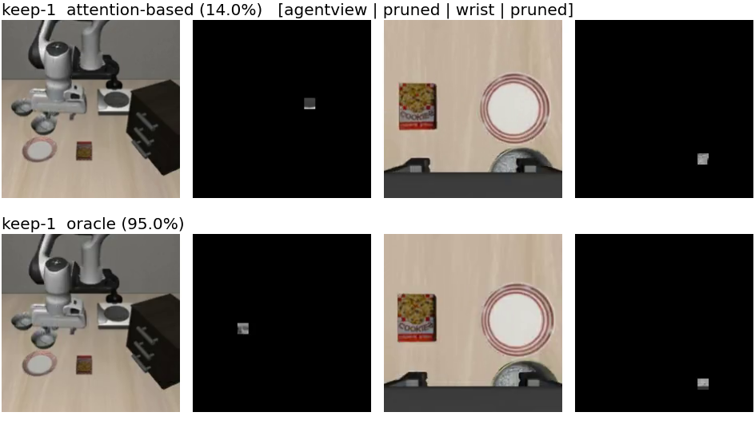
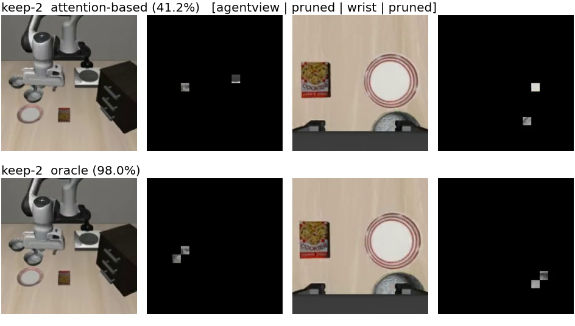
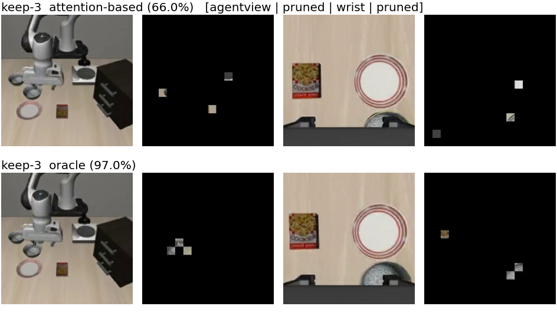
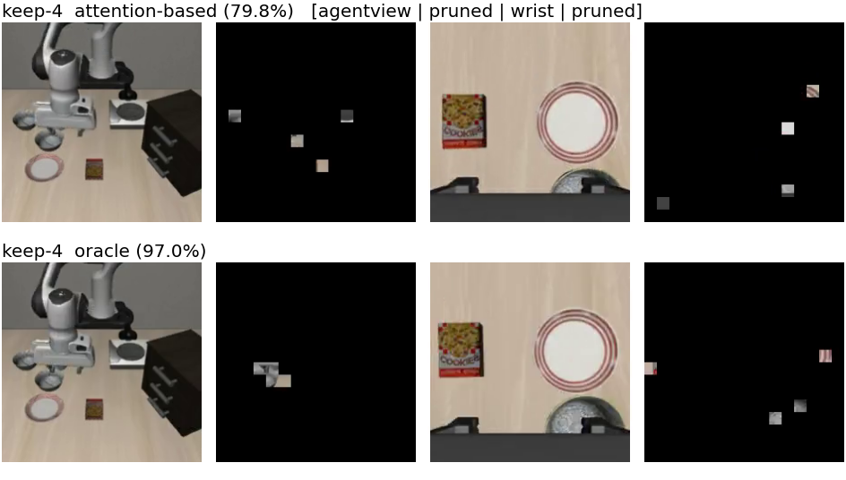
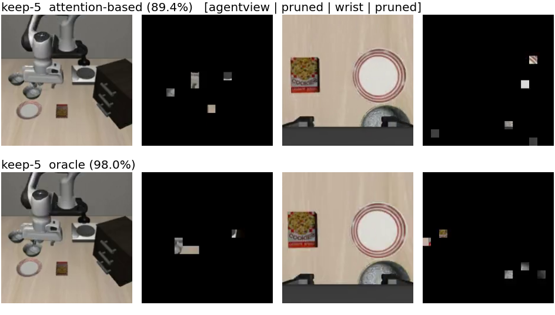

*Figure 6 — Episode 1, query 4 (first pruned query) for each k: attention-based pick (upper row of each pair) vs oracle pick (lower row). The oracle concentrates its patches on the target bowl / the bowl under the gripper; attention-based picks are scattered.*

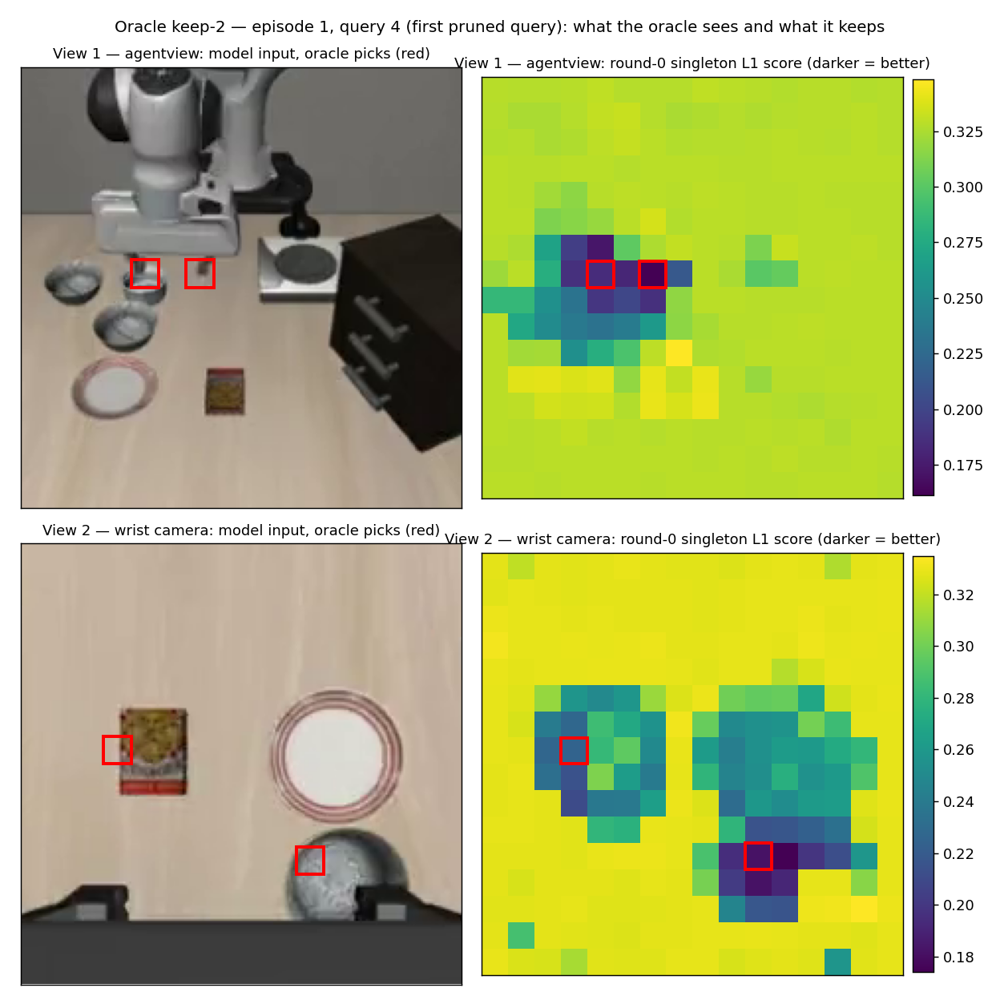

*Figure 7 — What the oracle "sees" and what it keeps (k = 2 run, episode 1, query 4 — the first pruned query). Left: the actual model input of each view with the two selected patches boxed in red (agentview: patch 116 on the bowl beneath the gripper and 118 just right of it between the gripper fingers; wrist: patch 186 on the bowl under the gripper and 115 on the cookie box). Right: the per-patch singleton L1 scores from the first greedy round as 16×16 grids — darker = that patch alone brings the action closer to the full-patch action — with the same final picks outlined in red. The red boxes were cross-checked against the episode's verification video (the un-blacked cells at this query are exactly these patches). These maps are saved for every searched query in the trace files.*
5. **Cost.** The oracle is an analysis instrument, not a method: 9–23 s per query (2,000+ tail evaluations). Runs took ≈3 h (k = 2) to ≈8 h (k = 5) for 100 episodes.

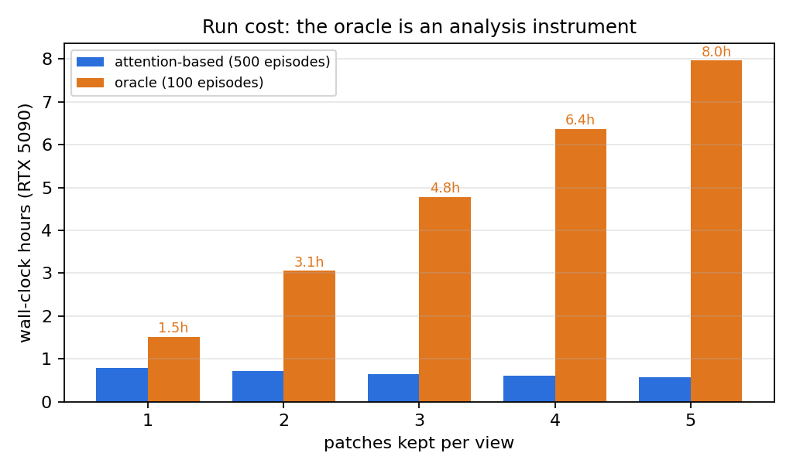

*Figure 8 — Wall-clock per run on one RTX 5090: attention-based runs (500 episodes) take ~0.6–0.8 h; oracle runs (100 episodes) scale with the 2k greedy rounds, 1.5 h → 8 h.*

### 3.4 Where everything lives
* Eval logs: `src/openvla-oft/experiments/logs/EVAL-libero_spatial-*--{full_keep{1..5}_pruner_vid, full_r100_pruner_vid, oracle_keep{1..5}}.txt`
* Oracle traces: `src/openvla-oft/experiments/logs/oracle_trace/<run_id>/ep*/step*.npz`
* Videos (one subdirectory per method and kept-patch count): `src/openvla-oft/rollouts/{baseline/keep256, fastv/keep26, vla_pruner/keep{0,1,2,3,4,5,26}, oracle/keep{1..5}}/`
* Interactive report (tables, smoke frames): https://claude.ai/code/artifact/7ec00d93-ca5c-43be-be4e-7246305f1388
* Figures used in this report: `Experiment/figures/` (regenerable from the logs, traces and videos above)
