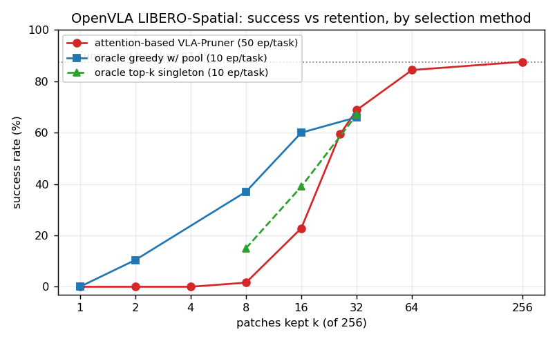
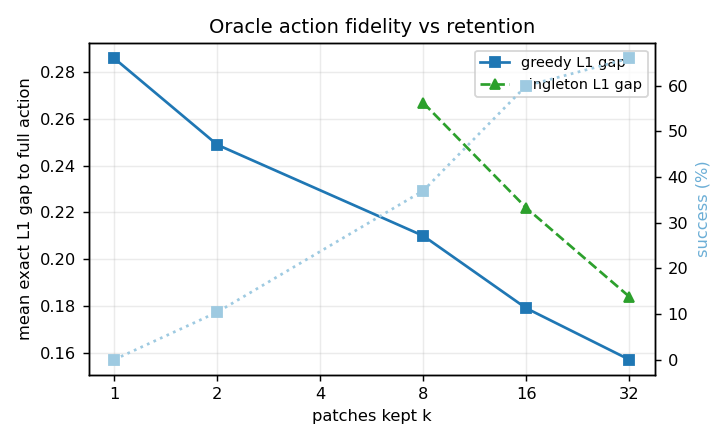
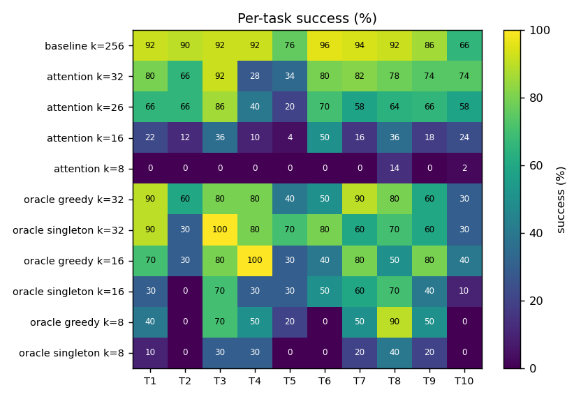
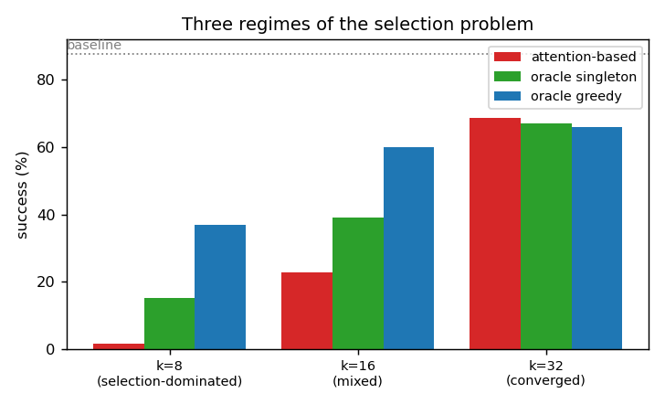
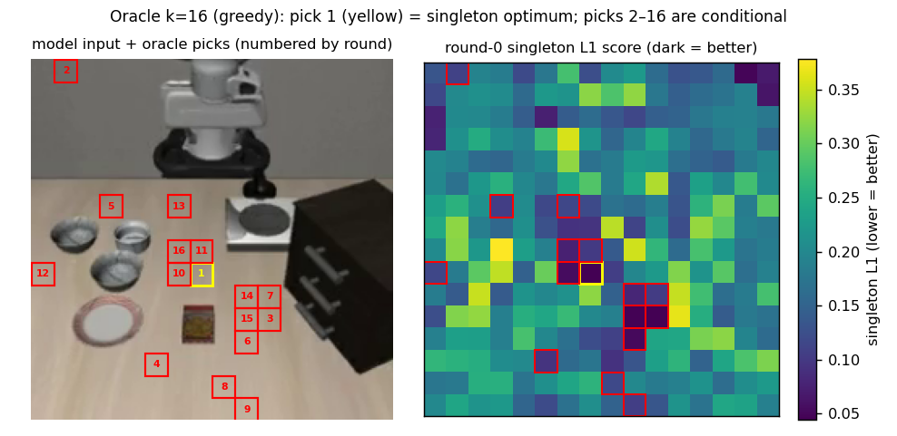
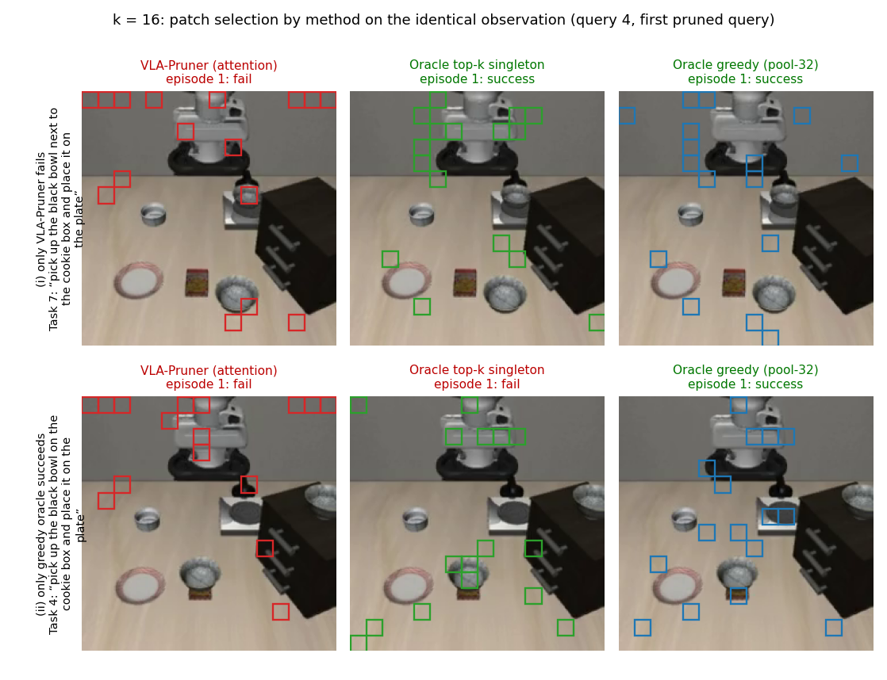
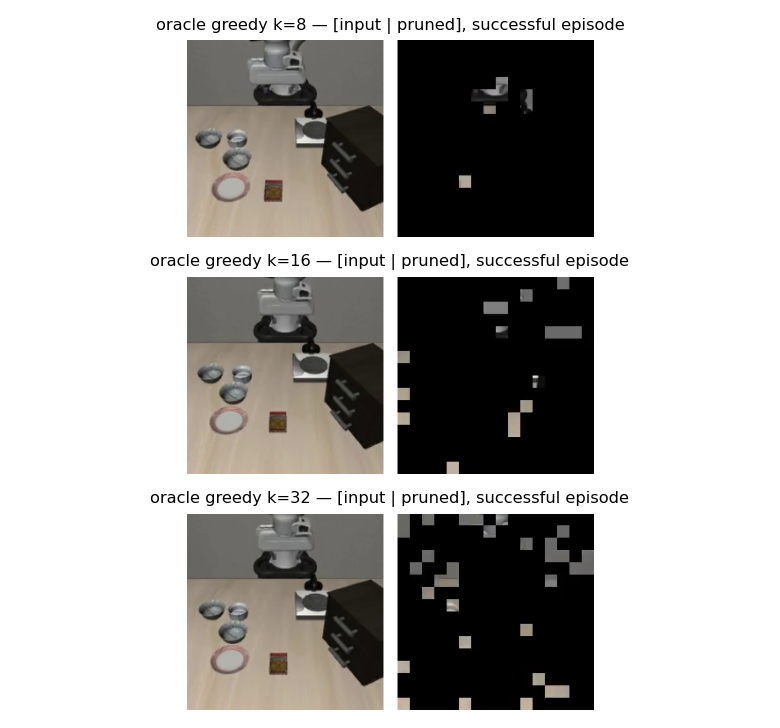

# OpenVLA: Retention Sweep and Oracle Patch Selection on LIBERO-Spatial

**Period:** 2026-08-21 (oracle implementation) → 2026-08-27 02:00 KST (final paired rerun)
**Model:** `openvla/openvla-7b-finetuned-libero-spatial` (single camera view, 256 visual tokens, 7-DoF actions decoded autoregressively as discrete bin tokens)
**Benchmark:** LIBERO-Spatial, 10 tasks, frozen benchmark initial states
**Hardware:** 1× RTX 5090 (32 GB), conda env `openvla`, code under `src/openvla/`
**Companion study:** `../2026-08-19_to_2026-08-21_openvla-oft_retention-sweep_and_oracle-patch-selection/` (OpenVLA-OFT)

---

## 1. Background — why this experiment

The companion OFT study found that OFT's low-retention "cliff" is a **selection limit**: an oracle that picks patches by matching the full-input action reaches 95–98 % with only 1–5 patches per view, while attention-based VLA-Pruner scores 14–89 % at the same retentions. The natural question: does the same hold for **OpenVLA**, which differs in every architectural dimension that plausibly matters — one camera view instead of two, autoregressive token-by-token action decoding instead of a parallel chunk head, a query every environment step instead of every eight, and the same layer-3 pruning cut but with no second view to fall back on?

Concretely we asked, per retention level k:
1. How does attention-based VLA-Pruner degrade as k shrinks (sweep k = 1…32)?
2. What is the **upper bound of any selection method** (oracle greedy search)?
3. How much of the oracle's advantage comes from **conditional (greedy) selection** versus simply taking the k **individually best** patches (top-k singleton)?

## 2. Verification — experiment design

### 2.1 Protocol
LIBERO-Spatial, frozen init states (trial *i* = state *i*: all methods see identical episodes; 10-trial runs use a strict subset of the 50-trial episodes), max 220 env steps, one model query per step (~120–220 queries/episode). Pruning at LLM layer `fastv_k = 3`; retention = k/256 (`fastv_r = 1 − k/256`); non-visual tokens always kept; VLA-Pruner's 3-query temporal warm-up mirrored in all oracle runs. Attention-based runs: 50 trials/task; oracle runs: 10 trials/task (search cost). Every episode renders a `[input | pruned]` verification video with dropped patches blacked out; mask counts were programmatically checked (256−k per frame after warm-up).

**Determinism proof.** The evaluation is bit-deterministic: the k=26 run was reproduced with identical per-task results, and a 10-trial k=32 rerun matched the first-10-episode extraction of the 50-trial run exactly (66/100, per-task identical, 10/10 task-level predictions correct). All method comparisons are therefore paired, episode-for-episode.

### 2.2 Oracle selection
Goal per query: the k patches whose pruned-input action is closest (mean L1, normalized bin-center action space) to the full-input action **A_full**; the winning set's action — decoded by the true autoregressive pruned inference — is executed.

- **Efficient evaluation.** Layers 0–2 are candidate-independent: run once, cache K/V and the layer-3 boundary hidden state. Naively each candidate still needs 7 sequential decode steps (~50–80 s/query — infeasible). Instead candidates are scored with a **teacher-forced surrogate**: append the embeddings of A_full's first 6 tokens to the candidate's pruned sequence at the positions cached generation would give them, run layers 3–31 once, read the 7 next-token distributions, and score by the L1 between their **expected actions** (softmax over the 256 action-bin vocab ids × bin centers) and A_full. One batched forward evaluates a whole greedy round (≤256 candidates). The winner is then decoded exactly.
- **Greedy w/ pool:** k rounds of conditional selection; after round 1 (all 256 singletons scored — kept as an importance map), later rounds consider only the top-M singletons (M = 32 for k = 8/16, M = 64 for k = 32) — ~4× cheaper, slightly conservative bound.
- **Top-k singleton:** no greedy rounds — jointly keep the k patches with the best singleton scores.
- **Correctness gates** (all passed; `experiments/robot/libero/test_oracle_equivalence.py`): FastV's own keep-set forced through the oracle evaluator reproduces FastV's action **bit-exactly (0.000000)**, and in reverse; all-256 ≡ dense; teacher-forced argmax at keep-256 reproduces the dense action tokens 7/7. Two pitfalls found and fixed en route: (i) this fork's attention silently uses the **sdpa kernel unless `output_attentions=True`** (the repo's path always requests weights → eager); mismatching kernels drift logits ~0.6 and flip near-tie action tokens — all oracle runners now force the eager path; (ii) a test-fixture bug (in-place proprio normalization on a reused observation dict).
- **Cost (measured):** ~0.9–1.6 s/query at k≤16 with pool, ~4–8 s at k=32 (pool-64); runs of 100 episodes took ~4 h (k=8 singleton) to ~26 h (k=32 greedy).

### 2.3 Attention-based reference
The repo's VLA-Pruner configuration (`use_fastv + use_temporal + use_prefil_attention`, `fastv_k 3`), swept at k = 1, 2, 4, 8, 16, 26 (paper's 90 % point, reproduced exactly), 32, plus the earlier 75 % (k=64) and unpruned baselines.

## 3. Results

*Figure 1. Success rate vs patches kept, by selection method. The oracle floor at k ≤ 2, the selection-dominated band at k = 8–16, and the three-way convergence at k = 32 are all visible.*

### 3.1 Main table

| k | Pruning | Attention (50 ep) | Oracle singleton (10 ep) | Oracle greedy (10 ep) | Attention, paired first-10 |
|---|---|---|---|---|---|
| 256 | 0 % | **87.6 %** | — | — | — |
| 64 | 75 % | 84.4 % | — | — | — |
| 32 | 87.5 % | **68.8 %** | 67.0 % | 66.0 % | 66 % |
| 26 | 90 % | 59.4 % (repro exact) | — | — | 53 % |
| 16 | 93.75 % | 22.8 % | 39.0 % | **60.0 %** | 20 % |
| 8 | 96.9 % | 1.6 % | 15.0 % | **37.0 %** | 0 % |
| 4 | 98.4 % | 0.0 % | — | — | — |
| 2 | 99.2 % | 0.0 % | — | 10.4 % (partial, 48 ep) | — |
| 1 | 99.6 % | 0.0 % | — | 0.0 % | — |

FastV @ 90 %: 49.8 % (VLA-Pruner +9.6). Mean exact L1 gap to A_full (oracle traces): greedy 0.286/0.249/0.210/0.179/0.157 and singleton —/—/0.267/0.222/0.184 at k = 1/2/8/16/32.

*Figure 2. Oracle action fidelity (mean exact L1 gap to the full-input action) improves smoothly with k while success saturates later — the mirror image of OFT, where success saturated first.*

*Figure 3. Per-task success (%) for all completed runs.*

### 3.2 Three regimes

*Figure 4. The three regimes of the selection problem: attention-based vs singleton-oracle vs greedy-oracle success at k = 8, 16, 32.*

1. **k ≤ 4 — information floor.** Even optimal selection fails (oracle 0 % at k=1, ~10 % at k=2; L1 gaps ≥ 0.25). One or two 14-px patches cannot carry OpenVLA's visuomotor mapping — in sharp contrast to OFT, whose oracle hits 95–98 % at the same per-view counts (two views, chunked decoding).
2. **k = 8–16 — selection-dominated.** The greedy oracle achieves 37 % where attention-based selection gets 1.6 % (23×), and 60 % vs 22.8 % at k = 16 — matching what attention needs 26 patches for. Conditioning matters most here: singleton selection recovers only ~40 % of the oracle headroom (15 %/39 %), because individually-best patches are redundant neighbors on the same object.
3. **k = 32 — converged.** Attention 68.8 % ≈ singleton 67.0 % ≈ greedy 66.0 %. With 32 slots, any sensible criterion covers the task-relevant regions; all three plateau **~20 points below the baseline**. The residual is inherent to the pruning mechanism (single view, causal decoding, layer-3 cut), not to patch choice.

### 3.3 Where the oracle looks

*Figure 5. Left: model input with the 16 greedy picks, numbered by selection round (pick 1 in yellow). Right: round-0 singleton score map (viridis, dark = lower L1 = better). Pick 1 sits exactly on the singleton optimum (verified: argmin cell = pick-1 cell); picks 2–16 are conditional argmins whose singleton ranks span 1–30 of the top-32 pool — greedy deliberately spreads across complementary regions rather than stacking the singleton-best cells.*

*Figure 6. Patch selection by method on the identical observation (k = 16, first pruned query of paired episodes). Row 1 — Task 7 ("pick up the black bowl next to the cookie box and place it on the plate"), an episode where only VLA-Pruner fails; row 2 — Task 4 ("pick up the black bowl on the cookie box and place it on the plate"), an episode where only the greedy oracle succeeds. Attention scatters picks over the robot arm and background; singleton clusters on the singleton-optimal object region; greedy spreads across bowl, target plate, and gripper context.*

**Video 1.** Full execution of the Figure-6 row-1 episode (Task 7, only VLA-Pruner fails) — three methods side by side, each as its [input | pruned] verification pair; shorter episodes freeze on their final frame. ([file](videos/task7_k16_method_comparison.mp4))

<video src="videos/task7_k16_method_comparison.mp4" controls width="1200"></video>

**Video 2.** Full execution of the Figure-6 row-2 episode (Task 4, only the greedy oracle succeeds). ([file](videos/task4_k16_method_comparison.mp4))

<video src="videos/task4_k16_method_comparison.mp4" controls width="1200"></video>

*Figure 7. Verification-video frames ([input | pruned]) from successful oracle-greedy episodes at k = 8, 16, 32.*

### 3.4 Practical implications for VLA-Pruner

- On OpenVLA, the window where better selection pays is **8–16 patches (94–97 % pruning)**: a stronger criterion could plausibly gain 2–3× success over attention scores there.
- At the paper's 90 % operating point and above, attention-based selection is already near the selection-quality ceiling; the remaining ~20-point loss must be attacked through the pruning mechanism (later cut layer, multi-view redundancy, chunked/action-aware decoding — i.e., the OFT direction), not through smarter patch scoring.
- The oracle machinery (teacher-forced surrogate ≈ 300–1,800 single-forward candidate evaluations per query) is an analysis instrument; its traces (~100k searched queries, round-0 importance maps) are a labeled dataset of "action-relevant patches" that could supervise a learned selector.

### 3.5 Where everything lives

- Logs: `src/openvla/experiments/logs/EVAL-*--{keep{1,2,4,8,16,32}_vlapruner, keep26_vlapruner_repro, keep32_vlapruner_10ep, oracle_keep{1,2}, oracle_k{8,16}_pool32, oracle_k16_topk, oracle_k8_topk, oracle_k32_pool64, oracle_k32_topk}.txt`
- Oracle traces: `src/openvla/experiments/logs/oracle_trace/<run_id>/ep*/query*.npz`
- Videos (per method/k): `src/openvla/rollouts_dev/{vla_pruner/keep{1,2,4,8,16,26_repro,32,32_10ep}, oracle/keep{1,2_partial,8_pool32,8_topk,16_pool32,16_topk,32_pool64,32_topk}}/`
- Interactive report: https://claude.ai/code/artifact/7ec00d93-ca5c-43be-be4e-7246305f1388
