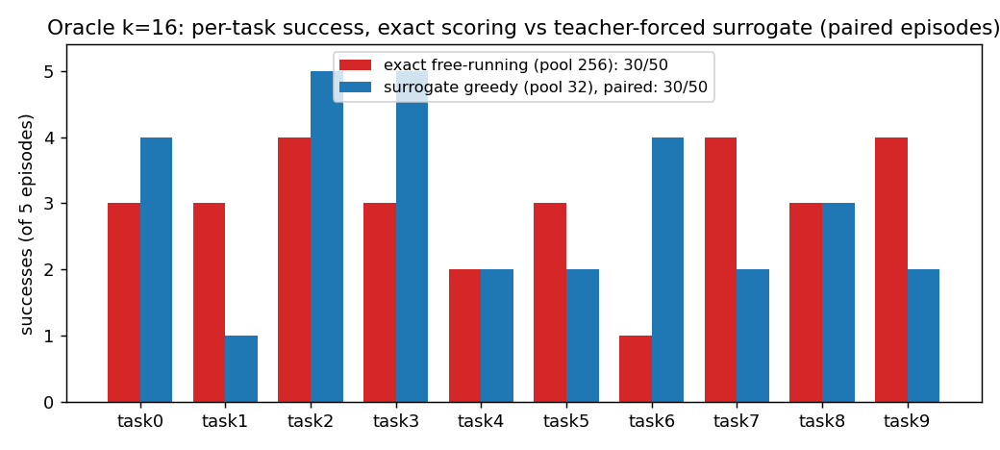
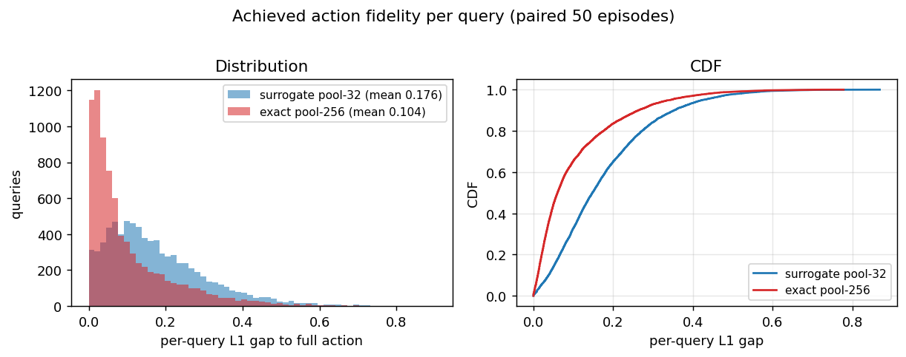
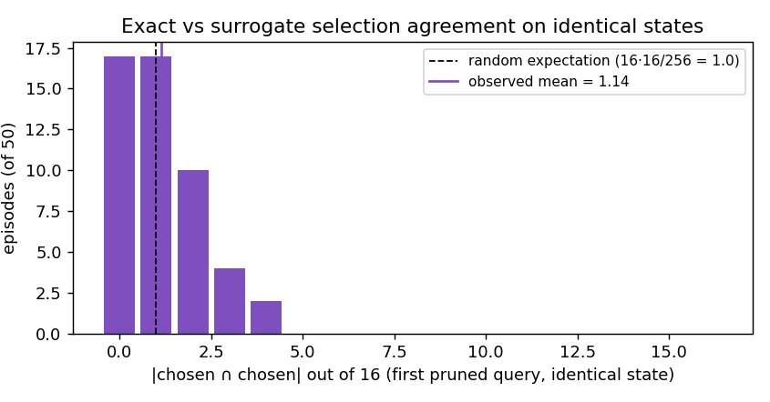
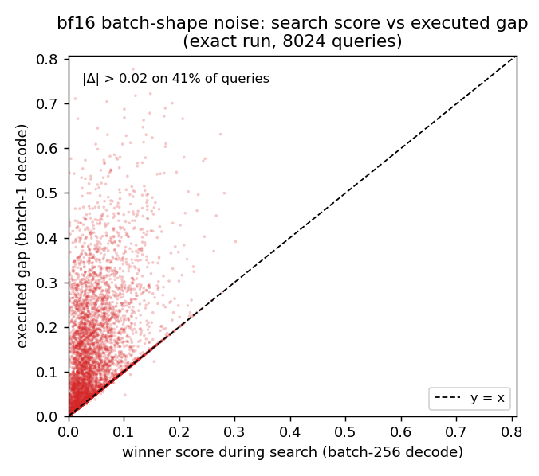
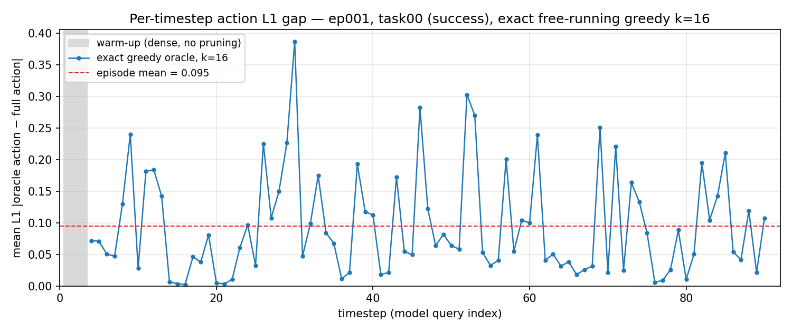
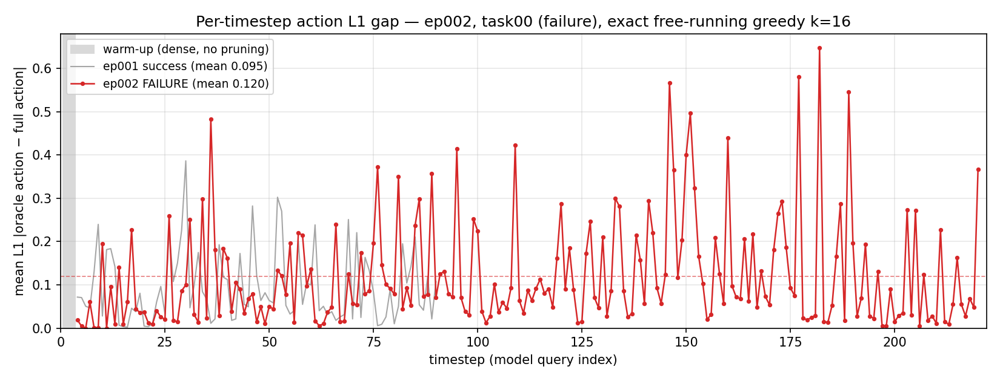

# OpenVLA: Exact Free-Running Oracle at k = 16 — Is the Surrogate the Bottleneck?

**Period:** 2026-08-27 21:32 KST (launch) → 2026-08-29 ~07:15 KST (50/50 episodes, exit 0)
**Model:** `openvla/openvla-7b-finetuned-libero-spatial` (256 visual tokens, 7-DoF actions decoded autoregressively)
**Benchmark:** LIBERO-Spatial, 10 tasks × 5 trials (frozen init states → episode-for-episode paired with all earlier runs)
**Hardware:** 1× RTX 5090 (32 GB), conda env `openvla`, code under `src/openvla/`
**Predecessor:** `../2026-08-21_to_2026-08-27_openvla_retention-sweep_and_oracle-patch-selection/` (all prior oracle machinery, the k-sweep, and the surrogate design)

---

## 1. Background — why this experiment

The predecessor study scored oracle candidates with a **teacher-forced surrogate**: append the *full-input* action's first 6 tokens to the candidate's pruned sequence, run one forward, and score by the expected action of the resulting 7 distributions. That surrogate has two known biases:

1. **Exposure bias** — every candidate is evaluated while conditioned on A_full's trajectory, not on the tokens the candidate itself would decode. A patch set that would drift at step 2 of its own decode is scored as if it never drifted.
2. **Expected-vs-argmax mismatch** — the surrogate scores the softmax-expected action, but execution takes the argmax token per step.

At k = 16 the surrogate greedy oracle reached 60 % against the 87.6 % unpruned baseline — a −27.6 pt residual. The open question: **is part of that residual an artifact of surrogate scoring?** If a candidate set exists whose own free-running decode matches A_full much better, the surrogate would never find it, and the "oracle upper bound" would be understated.

This experiment removes both biases entirely: every candidate keep-set is scored by its **own full greedy autoregressive decode** — no teacher forcing anywhere in the search — with **pure greedy selection over the full 256-patch pool** (no top-M pool restriction, removing that second conservatism as well).

## 2. Verification — experiment design

### 2.1 Exact free-running scoring
New flag `--oracle_scoring exact` (default `surrogate` preserves the old path). Flag chain: `GenerateConfig.oracle_scoring` (`run_libero_eval.py`) → `_configure_attention_pruning` (`openvla_utils.py`) → `_oracle_predict_action` (`modeling_prismatic.py`). **No vendored-llama change was needed** — exact mode reuses the existing `oracle_tail_prefill` / `oracle_decode_step` helpers via `_oracle_generate_batch`: for each candidate chunk, 1 batched tail prefill through layers 3–31 + 6 batched single-token decode steps; score = fp32 mean-L1 between the decoded bin-center action and A_full's bin centers. The executed action is always a fresh **batch-1** exact decode of the winning set (never a score reused from the search).

Per query at k = 16, pure greedy over 256 candidates ≈ 16 rounds × ~249 candidates ≈ **3,976 full decodes**.

### 2.2 Pre-launch benchmark (single real mid-episode query)
| configuration | s/query | peak GPU | self-consistent* |
|---|---|---|---|
| surrogate, pure greedy, batch 64 | 13.2 s | 14.5 GiB | — |
| exact, batch 64 | 18.7 s | 16.7 GiB | yes |
| exact, batch 128 | 16.6 s | 19.4 GiB | **no** (in-chunk 0.0000 vs solo re-decode 0.0123) |
| exact, batch 256 | **15.8 s** | 24.0 GiB | yes |

\*winner's in-search score reproduced by an independent batch-1 decode. Exact scoring is only ~20 % slower than the surrogate because the batched single-token decode steps are nearly free next to the tail prefill. Batch 256 chosen. The b128 inconsistency previewed the bf16 batch-shape numerics analyzed in §3.4. Projected 33 h for 50 episodes at 5 trials/task (chosen by the user over 10-episode/20-episode options); actual ≈ 34 h.

### 2.3 Run configuration
```
python experiments/robot/libero/run_libero_eval.py \
  --pretrained_checkpoint checkpoints/openvla-7b-finetuned-libero-spatial \
  --task_suite_name libero_spatial --use_fastv False --use_oracle_pruner True \
  --fastv_k 3 --fastv_r 0.9375 --oracle_selection greedy --oracle_candidate_pool 256 \
  --oracle_scoring exact --oracle_batch_size 256 \
  --num_trials_per_task 5 --run_id_note oracle_k16_exact
```
Same protocol as all prior runs: pruning at layer 3, non-visual tokens always kept, 3-query dense warm-up, per-query npz traces (`query_idx, full_action, oracle_action, l1_gap, surrogate_gap`(=winner's in-search score)`, round_scores, chosen, round0_scores`), per-episode `[input | pruned]` verification videos. Because init states are frozen and warm-up is dense in both runs, episode *i* here is **bit-identical in its initial state** to episode *i* of the pool-32 surrogate run — the comparison below uses exactly the paired first-5-episode subset of that run (also 30/50 on this subset).

## 3. Results

**Headline: 30/50 = 60.0 % — exactly tying the pool-32 teacher-forced surrogate on paired episodes, despite a 41 % reduction in per-step action gap.** The −27.6 pt residual at k = 16 is *not* a scoring-fidelity artifact.

### 3.1 Success: identical total, strongly shuffled per task



*Figure 1. Per-task successes on the 50 paired episodes. Totals tie at 30/50; individual tasks swing by up to ±3 (task03 −3, task06 −3, task01 +2, task07 +2 for exact vs surrogate).*

| | exact free-running (pool 256) | surrogate greedy (pool 32), paired |
|---|---|---|
| **Success** | **30/50 (60.0 %)** | **30/50 (60.0 %)** |
| Per task (0–9) | 3, 3, 4, 3, 2, 3, 1, 4, 3, 4 | 4, 1, 5, 5, 2, 2, 4, 2, 3, 2 |
| Mean / median / max L1 gap | **0.104 / 0.061 / 0.778** (8,024 q) | 0.176 / 0.148 / 0.868 (7,832 q) |
| Search cost | 15.8 s/query (~3,976 decodes) | 3.4 s/query (pool-32) |

### 3.2 Per-step fidelity improves 41 % — success does not move



*Figure 2. Exact scoring shifts the whole per-query gap distribution left (mean 0.176 → 0.104, median 0.148 → 0.061). If episode success were limited by per-step action fidelity at this level, this shift should have shown up in the success rate. It did not.*

### 3.3 The selection landscape is degenerate



*Figure 3. Chosen-set agreement measured where it is exactly fair: the first pruned query of each episode, where both runs face a bit-identical state (dense warm-up + frozen init). Mean overlap is 1.14 of 16 patches — statistically indistinguishable from random (16·16/256 = 1.0). 34 of 50 episodes overlap on ≤1 patch.*

Two scoring criteria that both achieve strong action fidelity select **essentially disjoint** patch sets on the same state — direct evidence that many near-equivalent optima exist. Improving the scorer moves you between roughly equally good optima; it does not find a categorically better one. This is why individual tasks shuffle ±3 episodes while the aggregate is invariant.

### 3.4 Caveat quantified: bf16 batch-shape noise in the search



*Figure 4. Winner's in-search score (batch-256 decode) vs its executed gap (batch-1 decode). Same weights, same tokens — only the batch shape differs, yet 41 % of queries move by > 0.02 L1 (mean |Δ| = 0.061). bf16 kernels reduce in different orders per batch shape, flipping near-tie argmax tokens during decode.*

Implication: logged `round_scores`/`surrogate_gap` carry batch-shape noise, and near-tie argmins during the search are effectively randomized. The **executed** action is unaffected (always a genuine batch-1 decode), so success rates are clean. But this also means an "exact" scorer on a degenerate landscape partially selects by numerical noise — a further reason not to expect scoring refinements to help at k = 16.

### 3.5 Where episodes are lost: sustained high-gap regimes, not spikes



*Figure 5. Successful episode (ep001, task00): mean gap 0.095, spikes at grasp/transition steps but always recovering.*



*Figure 6. Failed episode (ep002, task00; ep001 in gray for reference): mean 0.120 — but the discriminator is the sustained high-gap stretch (queries ~140–190, peaking 0.648), not the typical step (medians 0.077 vs 0.064). Across the run, failures have worst-10-query rolling means of ~0.29 vs ~0.16 in successes. Caveat: late-episode gaps conflate selection limits with already-drifted states.*

Videos of these two episodes: `videos/ep001_task00_success.mp4`, `videos/ep002_task00_failure.mp4`.

### 3.6 Conclusion

The predecessor study's k-sweep left one loose end: the 60 % oracle plateau at k = 16 might have been an artifact of teacher-forced scoring. This run closes it. With **zero teacher forcing, full 256-candidate pooling, and 3,976 exact decodes per query**, the oracle still scores 60.0 % — the same as the far cheaper surrogate. The k = 16 picture is therefore final:

- The −27.6 pt residual vs baseline is **rollout-level compounding of small per-step deviations**, not scoring fidelity and not pool restriction. Per-step gap can be pushed down 41 % without any effect on episode outcomes.
- Combined with the k = 32 convergence result (attention ≈ singleton ≈ greedy ≈ 66–69 %), no selection *or* scoring refinement recovers the gap: below ~32 patches the loss is inherent to layer-3 single-view pruning of this model.
- Practical corollary for VLA-Pruner: at k = 16 the realistic target for any trainable/attention criterion remains the ~60 % oracle band, and closing the last ~28 pts requires changing *what* is pruned (layer, granularity, view handling), not *how patches are picked*.

### 3.7 Where everything lives

- Eval log: `src/openvla/experiments/logs/EVAL-libero_spatial-openvla-2026_08_27-21_32_37--oracle_k16_exact.txt`
- Traces (8,024 npz): `src/openvla/experiments/logs/oracle_trace/EVAL-...--oracle_k16_exact/ep{001..050}_task*_{success,failure}/`
- Videos (50): `src/openvla/rollouts_dev/oracle/keep16_exact/`
- Code: `--oracle_scoring` in `run_libero_eval.py` / `openvla_utils.py` / `modeling_prismatic.py` (`_oracle_predict_action` exact branch); vendored llama untouched
- Results artifact (pruning summary page): https://claude.ai/code/artifact/7ec00d93-ca5c-43be-be4e-7246305f1388
